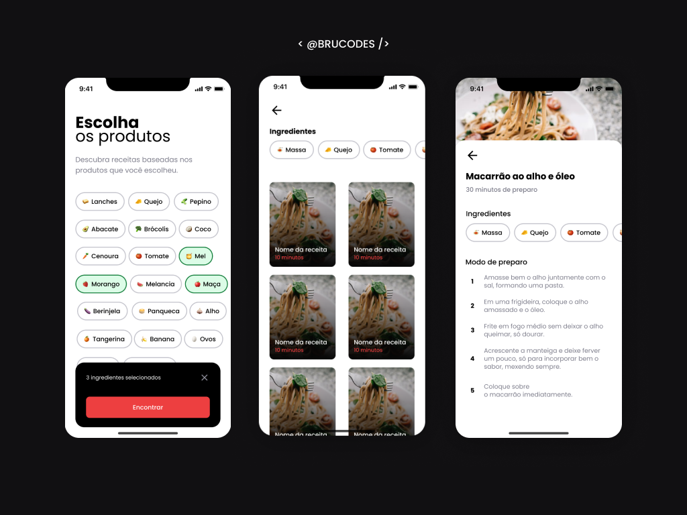

## Cook App 🍎

An app that suggests recipes based on the selected ingredients.
 
## Technologies

- `React Native`
- `TypeScript`
- `Tailwind CSS`
- `Supabase`
- `Expo`
- `Expo Go`
- `React Native Reanimated`

## Features

Here's what you can do with Cook App:

Imagine getting home hungry after a long day of work and realizing that you forgot to stop by the grocery store to do your weekly shopping. So, you decide to open the fridge to make dinner with whatever you have at home, but you're not feeling very creative in the kitchen.

That's where the Cook App comes in! This app suggests recipes based on the ingredients you have available. It's a handy solution for those moments when you need dinner ideas but don't want to go out shopping.

## Running the Project

To run the project in your local environment, follow these steps:

*Dependencies: Node.js, Git, Expo Go, Android Emulator (Android Studio)*

1. Clone the repository to your local machine.
2. Run `npm install` in the project directory to install the required dependencies.
3. Run `npm i` to get the node_modules.
4. Run `npm expo start` to get the project started.
5. Open Expo Go app on your iOS or Android device.
6. Use your mobile device's camera to scan the QRcode.

## Preview

<h1 align="center">
  
</h1>
